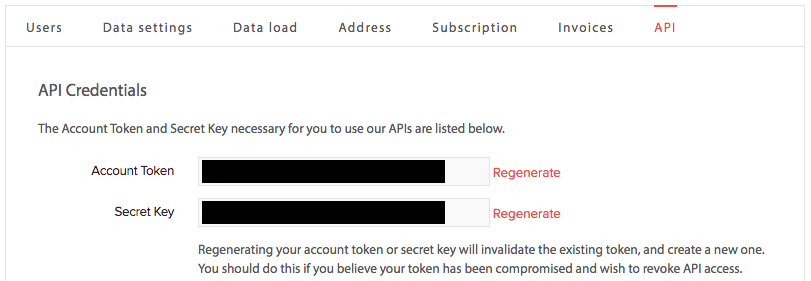

# ChartMogul Enrichment API

## Overview  

The ChartMogul Enrichment API allows you to programmatically add, modify, and access customer metadata in your ChartMogul account. We refer to this metadata as Customer Attributes.

The main Customer Attributes accessible through this API are,  

- **Tags** on Customer Profiles
- **Custom attributes** set via this API
- **Stripe metadata** we pull from your Stripe account
- **Clearbit's** data

The API supports [Cross-origin Resource Sharing (CORS)](http://en.wikipedia.org/wiki/Cross-origin_resource_sharing) to allow you to consume it from a client-side application. However, be careful to never expose your API key in any client-side code.

All request and response bodies are formatted in [JSON](http://json.org/).

## API Endpoint

The endpoint for the ChartMogul Enrichment API is `https://api.chartmogul.com/v1/` .

All requests to the endpoint must be made over [HTTPS](http://en.wikipedia.org/wiki/HTTP_Secure). Requests over HTTP will fail.

## Authentication

The ChartMogul Enrichment API uses HTTP Basic Authentication. This means that with **every** request you must provide your Account Token and Secret Key.

**Where are my API credentials?**

You can find your Account Token and Secret Key in the ChartMogul [Admin pages](https://app.chartmogul.com/#admin/api) (click the gear icon in the bottom left of your account - you need to be an admin on your account). Here you will see an API tab:


## HTTP Response Codes

The following response codes may be returned by the endpoint:

- `200` - OK (Everything worked as expected)
- `400` - Bad Request (Often missing a required parameter)
- `401` - Unauthorized (Authentication failed. See [Authentication](https://github.com/chartmogul/platform/wiki/Enrichment-API#authentication))
- `402` - Request Failed (Parameters were valid but request failed)
- `404` - Not Found (The requested item doesn't exist)
- `500`, `502`, `503`, `504` - Server Errors (Something went wrong on ChartMogul's end)

## Endpoint Overview

- [`GET /customers`](https://github.com/chartmogul/enrichment-api/blob/master/API-Documentation/api.md#get-customers) - Get a paginated customers list with basic information and attributes
- [`GET /customers/{customer_id}`](https://github.com/chartmogul/enrichment-api/blob/master/API-Documentation/api.md#get-customerscustomer_id) - Get the basic information and attributes for customer with ChartMogul ID `{customer_id}`
- [`GET /customers/search`](https://github.com/chartmogul/enrichment-api/blob/master/API-Documentation/api.md#get-customerssearch) - Find information for a specific customer email
- [`GET /customers/{customer_id}/attributes`](https://github.com/chartmogul/enrichment-api/blob/master/API-Documentation/api.md#get-customerscustomer_idattributes) - Get all the attributes of customer with ChartMogul ID `{customer_id}`
- [`POST /customers/{customer_id}/attributes/tags`](https://github.com/chartmogul/enrichment-api/blob/master/API-Documentation/api.md#post-customerscustomer_idattributestags) - Add tags for customer with ChartMogul ID `{customer_id}`
- [`POST /customers/attributes/tags`](https://github.com/chartmogul/enrichment-api/blob/master/API-Documentation/api.md#post-customersattributestags) - Add tags for customers who have the specified email
- [`DELETE /customers/{customer_id}/attributes/tags`](https://github.com/chartmogul/enrichment-api/blob/master/API-Documentation/api.md#delete-customerscustomer_idattributestags) - Delete tags from customer with ChartMogul ID `{customer_id}`
- [`POST /customers/{customer_id}/attributes/custom`](https://github.com/chartmogul/enrichment-api/blob/master/API-Documentation/api.md#post-customerscustomer_idattributescustom) - Add custom attributes to customer with ChartMogul ID `{customer_id}`
- [`POST /customers/attributes/custom`](https://github.com/chartmogul/enrichment-api/blob/master/API-Documentation/api.md#post-customersattributescustom) - Add custom attributes to customers who have the specified email
- [`DELETE /customers/{customer_id}/attributes/custom`](https://github.com/chartmogul/enrichment-api/blob/master/API-Documentation/api.md#delete-customerscustomer_idattributescustom) - Delete custom attributes from customer with ChartMogul ID `{customer_id}`
- [`PUT /customers/{customer_id}/attributes/custom`](https://github.com/chartmogul/enrichment-api/blob/master/API-Documentation/api.md#put-customerscustomer_idattributescustom) - Modify custom attributes of customer with ChartMogul ID `{customer_id}`

**Note** - We will be transitioning to using slightly modified [`Version 1 UUIDs`] (https://en.wikipedia.org/wiki/Universally_unique_identifier#Version_1_.28MAC_address_.26_date-time.29) as identifiers for future versions of our API. With this API, we return `UUIDs` for customers to help ease the transition in the future.

## Examples

### CURL Request Format
```curl -X <HTTP_REQUEST_METHOD> "<endpoint URL>" -u <token>:<secret> ```

### GET /customers
Returns an `Array` of `entries` containing basic information and attributes of customers, in JSON.
- `page` (Integer, _optional_) - The page number for pagination of results. The default is page `1`
- `per_page` (Integer, _optional_) - A limit on number of customers to return per page. The default and maximum value is `200`

Results are returned in ascending order of the `customer-since` attribute.

Example CURL Request
```CURL
curl -X GET "https://api.chartmogul.com/v1/customers?page=1&per_page=50" \
    -u {token}:{secret}
```
Example Response
```JSON
{
    "entries":[
    {
        "id": 25647,
        "uuid": "cus_de305d54-75b4-431b-adb2-eb6b9e546012",
        "external_id": "34916129",
        "email": "bob@examplecompany.com",
        "name": "Example Company",
        "address": {
            "address_line1": "First line of address",
            "address_line2": "Second line of address",
            "address_zip": "0185128",
            "city": "Nowhereville",
            "country": "US",
            "state": "Alaska"
         },
        "customer-since": "2015-06-09T13:16:00-04:00",
        "status": "Active",
        "attributes": {
                        "custom": {
                                  "CAC": 213,
                                  "utmCampaign": "social media 1",
                                  "convertedAt": "2015-09-08 00:00:00",
                                  "pro": false,
                                  "salesRep": "Gabi"
                         },
                        "tags": ["engage", "unit loss", "discountable"],
                        "stripe": {
                                  "uid": 7,
                                  "coupon": true
                         }, 
                        "clearbit": {
                                    "id": "027b0d40-016c-40ea-8925-a076fa640992",
                                    "name": "Acme",
                                    "legalName": "Acme Inc.",
                                    "domain": "acme.com",
                                    "url": "http://acme.com",
                                    "metrics": {
                                                 "raised": 1502450000,
                                                 "employees": 1000,
                                                 "googleRank": 7,
                                                 "alexaGlobalRank": 2319,
                                                 "marketCap": null
                                     },
                                    "category": {
                                                  "sector": "Information Technology",
                                                  "industryGroup": "Software and Services",
                                                  "industry": "Software",
                                                  "subIndustry": "Application Software"

                                     }
                         }           
         }  
    },
    {...49 more entries...}
    ],
    "has_more": true,
    "per_page": 50,
    "page": 1
}
```

### GET /customers/{customer_id}
Returns basic information and attributes of customer with ChartMogul ID `{customer_id}`, in JSON. No Parameters supported

Example CURL Request
```CURL
curl -X GET "https://api.chartmogul.com/v1/customers/{customer_id}" \
    -u {token}:{secret}
```
Example Response
```JSON
{
    "id": 25647,
    "uuid": "cus_de305d54-75b4-431b-adb2-eb6b9e546012",
    "external_id": "34916129",
    "email": "bob@examplecompany.com",
    "name": "Example Company",
    "address": {
                "address_line1": "First line of address",
                "address_line2": "Second line of address",
                "address_zip": "0185128",
                "city": "Nowhereville",
                "country": "US",
                "state": "Alaska"
     },
    "customer-since": "2015-06-09T13:16:00-04:00",
    "status": "Active",
    "attributes": {
                    "custom": {
                               "CAC": 213,
                               "utmCampaign": "social media 1",
                               "convertedAt": "2015-09-08 00:00:00",
                               "pro": false,
                               "salesRep": "Gabi"
                     },
                    "tags": ["engage", "unit loss", "discountable"],
                    "stripe": {
                               "uid": 7,
                               "coupon": true
                     }, 
                    "clearbit": {
                                 "id": "027b0d40-016c-40ea-8925-a076fa640992",
                                 "name": "Acme",
                                 "legalName": "Acme Inc.",
                                 "domain": "acme.com",
                                 "url": "http://acme.com",
                                 "metrics": {
                                             "raised": 1502450000,
                                             "employees": 1000,
                                             "googleRank": 7,
                                             "alexaGlobalRank": 2319,
                                             "marketCap": null
                                  },
                                 "category": {
                                              "sector": "Information Technology",
                                              "industryGroup": "Software and Services",
                                              "industry": "Software",
                                              "subIndustry": "Application Software"
                                  }
                     }           
     }
}
```
### GET /customers/search
Returns an `Array` of `entries` containing basic information and attributes of customers with the specified email, in JSON.
- `email` (String, _required_) - The email address of the required customer

Example CURL Request
```CURL
curl -X GET "https://api.chartmogul.com/v1/customers/search?email=bob@examplecompany.com" \
    -u {token}:{secret}
```
Example Response
```JSON
{
    "entries":[
    {
        "id": 25647,
        "uuid": "cus_de305d54-75b4-431b-adb2-eb6b9e546012",
        "external_id": "34916129",
        "email": "bob@examplecompany.com",
        "name": "Example Company",
        "address": {
            "address_line1": "First line of address",
            "address_line2": "Second line of address",
            "address_zip": "0185128",
            "city": "Nowhereville",
            "country": "US",
            "state": "Alaska"
         },
        "customer-since": "2015-06-09T13:16:00-04:00",
        "status": "Active",
        "attributes": {
                        "custom": {
                                  "CAC": 213,
                                  "utmCampaign": "social media 1",
                                  "convertedAt": "2015-09-08 00:00:00",
                                  "pro": false,
                                  "salesRep": "Gabi"
                         },
                        "tags": ["engage", "unit loss", "discountable"],
                        "stripe": {
                                  "uid": 7,
                                  "coupon": true
                         }, 
                        "clearbit": {
                                    "id": "027b0d40-016c-40ea-8925-a076fa640992",
                                    "name": "Acme",
                                    "legalName": "Acme Inc.",
                                    "domain": "acme.com",
                                    "url": "http://acme.com",
                                    "metrics": {
                                                 "raised": 1502450000,
                                                 "employees": 1000,
                                                 "googleRank": 7,
                                                 "alexaGlobalRank": 2319,
                                                 "marketCap": null
                                     },
                                    "category": {
                                                  "sector": "Information Technology",
                                                  "industryGroup": "Software and Services",
                                                  "industry": "Software",
                                                  "subIndustry": "Application Software"

                                     }
                         }           
         }  
    },
    {...more matching entries...}
    ]
}
```

### GET /customers/{customer_id}/attributes
Returns a JSON output of attributes of the customer with ChartMogul ID `{customer_id}`. No parameters accepted.

Example CURL Request
```CURL
curl -X GET "https://api.chartmogul.com/v1/customers/{customer_id}/attributes" -u {token}:{secret}
```
Example Response
```JSON
{
    "attributes": {
                    "custom": {
                               "CAC": 213,
                               "utmCampaign": "social media 1",
                               "convertedAt": "2015-09-08 00:00:00",
                               "pro": false,
                               "salesRep": "Gabi"
                     },
                    "tags": ["engage", "unit loss", "discountable"],
                    "stripe": {
                               "uid": 7,
                               "coupon": true
                     }, 
                    "clearbit": {
                                 "id": "027b0d40-016c-40ea-8925-a076fa640992",
                                 "name": "Acme",
                                 "legalName": "Acme Inc.",
                                 "domain": "acme.com",
                                 "url": "http://acme.com",
                                 "metrics": {
                                             "raised": 1502450000,
                                             "employees": 1000,
                                             "googleRank": 7,
                                             "alexaGlobalRank": 2319,
                                             "marketCap": null
                                  },
                                 "category": {
                                              "sector": "Information Technology",
                                              "industryGroup": "Software and Services",
                                              "industry": "Software",
                                              "subIndustry": "Application Software"
                                  }
                     }           
     }
}
```
### POST /customers/{customer_id}/attributes/tags
Accepts an `Array` of `Strings` as `tags`, in JSON.
Returns a JSON output of `tags` of the customer with ChartMogul ID `{customer_id}`.

Example CURL Request
```CURL
curl -X POST "https://api.chartmogul.com/v1/customers/{customer_id}/attributes/tags" \
  -d '{ "tags": ["important", "Prio1"] }' \
  -H "Content-Type: application/json" \
  -u {token}:{secret}
```
Example Response
```JSON
{
    "tags": ["engage", "unit loss", "discountable", "important", "Prio1"]
}
```
### POST /customers/attributes/tags
Accepts an `email`, and an `Array` of `Strings` as `tags`, in JSON.
Returns an Array `entries` with JSON output of the customers with the specified `email`, and their `tags`.

Example CURL Request
```CURL
curl -X POST "https://api.chartmogul.com/v1/customers/attributes/tags" \
  -d '{ "email": "adam@smith.com", \
        "tags": ["important", "Prio1"] }' \
  -H "Content-Type: application/json" \
  -u {token}:{secret}
```
Example Response
```JSON
{
    "entries": [
                      { "id": 25647,
                        "uuid": "cus_de305d54-75b4-431b-adb2-eb6b9e546012",
                        "external_id": "40574176",
                        "email": "adam@smith.com",
                        "name": "Smith Company",
                        "customer-since": "2015-06-09T13:16:00-04:00",
                        "status": "Active",
                        "attributes":  { "tags": ["important", "Prio1"],
                                             "stripe": {"coupon": true},
                                             "clearbit": {"name": "Acme"},
                                             "custom": {"CAC": 213}
                                        }
                      },                       
                      { "id": 13456,
                        "uuid": "cus_fb305d54-75b4-431b-2334-eb6b9e540016",
                        "external_id": "58473129",
                        "email": "adam@smith.com",
                        "name": "Adam",
                        "customer-since": "2015-06-10T13:16:00-04:00",
                        "status": "Active",
                        "attributes":  { "tags": ["important", "Prio1"],
                                             "stripe": {"coupon": false},
                                             "clearbit": {"name": "Umbrella Corp"},
                                             "custom": {"CAC": 32}
                                        }
                        }
                    ],
    "has_more": false,
    "per_page": 200,
    "page": 1
}
```
### DELETE /customers/{customer_id}/attributes/tags
Accepts an `Array` of `Strings` as `tags`, in JSON.
Returns a JSON output of `tags` of the customer with ChartMogul ID `{customer_id}`.

Example CURL Request
```CURL
curl -X DELETE "https://api.chartmogul.com/v1/customers/{customer_id}/attributes/tags" \
  -d '{ "tags": ["Prio1", "discountable"] }' \
  -H "Content-Type: application/json" \
  -u {token}:{secret}
```
Example Response
```JSON
{
    "tags": ["engage", "unit loss", "important"]
}
```
### POST /customers/{customer_id}/attributes/custom
Accepts an `Array` of `JSON` objects as `custom`, in JSON. Each nested `JSON` object must contain values for the following keys.
- `type` (String, _required_) - Denotes the data type of the custom attribute. Can be `String`, `Integer`, `Timestamp` or `Boolean`  
- `key` (String, _required_) - Denotes the key of the custom attribute. Accepts alphanumeric characters and underscores.
- `value` (of data type `type`, _required_) - Denotes the value of the custom attribute.   

    `String` - Accepts alphanumeric characters  
    `Integer` - Accepts only numeric characters  
    `Timestamp` - In the [ISO 8601](https://en.wikipedia.org/wiki/ISO_8601) format  
    `Boolean` - Can be `TRUE`, `true`, `t`, `1`, `FALSE`, `false`, `f`, `0`  

Returns a JSON output of `custom` attributes of the customer with ChartMogul ID `{customer_id}`

Example CURL Request
```CURL
curl -X POST "https://api.chartmogul.com/v1/customers/{customer_id}/attributes/custom" \
  -d '{ "custom": [{"type": "String", "key": "channel", "value": "Facebook"}, \
                           {"type": "Integer", "key": "age", "value": 8}] }' \
  -H "Content-Type: application/json" \
  -u {token}:{secret}
```
Example Response
```JSON
{
    "custom": {
               "CAC": 213,
               "utmCampaign": "social media 1",
               "convertedAt": "2015-09-08 00:00:00",
               "pro": false,
               "salesRep": "Gabi",
               "channel": "Facebook",
               "age": 8
     }
}
```
### POST /customers/attributes/custom
Accepts an `email`, and an `Array` of `JSON` objects as `custom`, in JSON. Each nested `JSON` object must contain values for the following keys.
- `type` (String, _required_) - Denotes the data type of the custom attribute. Can be `String`, `Integer`, `Timestamp` or `Boolean`  
- `key` (String, _required_) - Denotes the key of the custom attribute. Accepts alphanumeric characters and underscores.
- `value` (of data type `type`, _required_) - Denotes the value of the custom attribute.   

    `String` - Accepts alphanumeric characters  
    `Integer` - Accepts only numeric characters  
    `Timestamp` - In the [ISO 8601](https://en.wikipedia.org/wiki/ISO_8601) format  
    `Boolean` - Can be `TRUE`, `true`, `t`, `1`, `FALSE`, `false`, `f`, `0`  

Returns an Array `entries` with JSON output of `custom` attributes of the customers with the specified `email`.

Example CURL Request
```CURL
curl -X POST "https://api.chartmogul.com/v1/customers/attributes/custom" \
  -d '{ "email": "adam@smith.com", \
        "custom": [{"type": "String", "key": "channel", "value": "Facebook"}, \
                           {"type": "Integer", "key": "age", "value": 8}] }' \
  -H "Content-Type: application/json" \
  -u {token}:{secret}
```
Example Response
```JSON
{
    "entries": [
                      { "id": 25647,
                        "uuid": "cus_de305d54-75b4-431b-adb2-eb6b9e546012",
                        "external_id": "40574176",
                        "email": "adam@smith.com",
                        "name": "Smith Company",
                        "customer-since": "2015-06-09T13:16:00-04:00",
                        "status": "Active",
                        "attributes": {"tags": ["important", "Prio1"],
                                             "stripe": {"coupon": true},
                                             "clearbit": {"name": "Acme"},
                                             "custom": {"channel": "Facebook", "age": 8}}
                       },
                      { "id": 13456,
                        "uuid": "cus_fb305d54-75b4-431b-2334-eb6b9e540016",
                        "external_id": "58473129",
                        "email": "adam@smith.com",
                        "name": "Adam",
                        "customer-since": "2015-06-10T13:16:00-04:00",
                        "status": "Active",
                        "attributes": {"tags": ["important", "Prio1"],
                                             "stripe": {"coupon": false},
                                             "clearbit": {"name": "Umbrella Corp."},
                                             "custom": {"channel": "Facebook", "age": 8}}
                      }
                    ],
    "has_more": false,
    "per_page": 200,
    "page": 1
}
```
### DELETE /customers/{customer_id}/attributes/custom
Accepts an `Array` of `Strings` denoting keys of custom attributes as `custom`, in JSON.
Returns a JSON output of `custom` attributes of the customer with ChartMogul ID `{customer_id}`

Example CURL Request
```CURL
curl -X DELETE "https://api.chartmogul.com/v1/customers/{customer_id}/attributes/custom" \
  -d '{ "custom": ["age", "salesRep"] }' \
  -H "Content-Type: application/json" \
  -u {token}:{secret}
```
Example Response
```JSON
{
    "custom": {
               "CAC": 213,
               "utmCampaign": "social media 1",
               "convertedAt": "2015-09-08 00:00:00",
               "pro": false,
               "channel": "Facebook"
     }
}
```
### PUT /customers/{customer_id}/attributes/custom
Accepts a `JSON` object as the value for key `custom`, in JSON.
Returns a JSON output of `custom` attributes of the customer with ChartMogul ID `{customer_id}`

Example CURL Request
```CURL
curl -X PUT "https://api.chartmogul.com/v1/customers/{customer_id}/attributes/custom" \
  -d '{ "custom": {"pro": true, "channel": "Twitter"} }' \
  -H "Content-Type: application/json" \
  -u {token}:{secret}
```
Example Response
```JSON
{
    "custom": {
               "CAC": 213,
               "utmCampaign": "social media 1",
               "convertedAt": "2015-09-08 00:00:00",
               "pro": true,
               "channel": "Twitter"
     }
}
```
